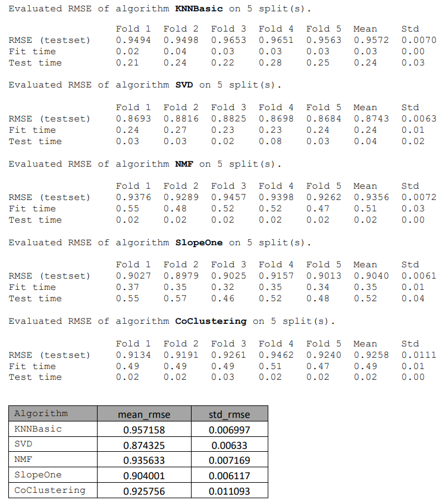

# Building a Movie Recommender System: Evaluation of ML Algorithms Using the Python Surprise Library

**Problem Statement**<br>
This project focused on developing and assessing a recommender system for predicting movie ratings based on historical data. The objective was to determine the most effective algorithm by minimizing the root mean squared error (RMSE) through cross-validation. The algorithms evaluated included:
* **KNNBasic:** A fundamental k-nearest neighbors collaborative filtering algorithm.
* **SVD:** The Funk SVD, a matrix factorization technique.
* **NMF:** Non-negative Matrix Factorization, a matrix factorization method with non-negativity constraints.
* **SlopeOne:** An item-based algorithm that computes predictions based on pairwise item similarities.
* **CoClustering:** A co-clustering algorithm that groups both users and items into clusters to make recommendations.

**Methodology**<br>

**Data Understanding**
* **Data Source:** The ` MovieLens` dataset from `https://grouplens.org/datasets/movielens/ ` which includes movie user ratings, tags and movie information (N = 100,836).
* **Features:** The dataset comprises `userId`, `movieId`, `rating`, `tag`, `title`, `genres`, and `year` .

**Data Preparation and Feature Engineering**<br>
The user ratings, tags, and movie information datasets were merged, with checks for duplicates and missing data. The final dataset was filtered to include complete ratings (1, 2, 3, 4, 5) from the year 1990 onwards.

```
Unique Ratings: [1.0, 2.0, 3.0, 4.0, 5.0]
Number of Unique Ratings: 5
Number of Users: 609
Number of Items: 5770
Number of Ratings: 52054
```

**Model Training and Evaluation**
* **Hyperparameter Tuning:** We tested `n_factors` values of 2, 3, 5, 10, 20, 30, 40, 50 for the SVD algorithm.
* **Model Selection:** Evaluated five different algorithms from the Surprise library; KNNBasic, SVD, NMF, SlopeOne, and CoClustering.
* **Model Evaluation:** Applied 5-fold cross-validation to compute the RMSE for each algorithm. The selected model’s performance was analyzed for movie rating predictions. 

**Results:**



**Interpretation:** The **Funk SVD** achieved the lowest mean RMSE, indicating it performs the best among the evaluated algorithms for predicting movie ratings in this dataset. This suggests SVD provides the most accurate predictions for this recommendation task.

**Hyperparameter tuning for SVD**
 


**Fitting SVD Model**<br>
The SVD model was trained on the whole dataset and evaluated using 5-fold cross-validation. In this method, the dataset is divided into 5 subsets (folds), and the model is trained on 4 folds and tested on the remaining fold. This process is repeated 5 times, each time with a different fold as the test set. 
The RMSE values for each fold represent the model's prediction errors compared to the actual values. Lower RMSE values indicate better performance.

 

**Interpretation:** <br>
The average RMSE across all folds was 0.8675, indicating that the model's predictions are approximately 0.8675 units away from the true values on average. The standard deviation of 0.0059 shows that RMSE values are consistently low across different folds, with minimal variation. The average test time was 0.02 seconds, reflecting stable and efficient performance.

**Random sample of 20 predictions**

  

**Paired T-test statistic comparing true ratings to predicted ratings**
* **T-statistic:** -1.1464
* **P-value:** 0.2516
* **Interpretation:** No significant difference was found between true and predicted ratings.

**Predictions for new ‘unseen’ data**, including  average and median ratings from the analysis dataset.
 
  

**Conclusion**<br>
The SVD model demonstrated stable and consistent performance with a low RMSE, indicating high predictive accuracy. The model's computational efficiency was also reliable, with consistent fit and test times.

**Future Work**<br>
Further research could include:<br>
•	Hyperparameter optimization for each algorithm to enhance performance.<br>
•	Exploration of additional algorithms or hybrid methods combining multiple approaches.<br>
•	Utilization of other datasets or integration of metadata (e.g., movie genres, tags) for improved recommendations.<br>

**References**<br>
•	Surprise Library Documentation: http://surpriselib.com/<br>
•	MovieLens Dataset: https://grouplens.org/datasets/movielens/


